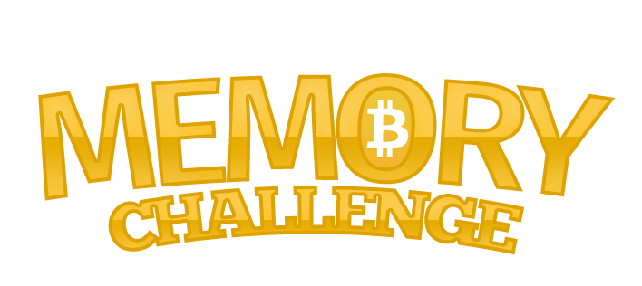

# MEMORY CHALLENGE

This comprehensive site was designed for a memory game. The focus of the site is to provide a functional memory game with a clean and modern design.

This is the second of four Milestone Projects that the developer must complete during the Full Stack Web Development Program at The Code Institute.

The main requirements were to make a responsive website that responds to the users actions, allowing users to actively engage with data, alter the way the 
site displays the information to achieve their preferred goals.

## UX

The purpose is to design an attractive website to play a memory game, with a simple and intuitive layout that works on mobiles, tablets or desktops.

## User Stories
### First Time Visitor Goals
1. As a first time visitor, I want to easily see and play the game.
2. As a first time visitor, I want to find information about how to play the game.
3. As a first time visitor, I want to find some guidence on how the game is developing.

### Returning Visitor Goals
1. As a Returning Visitor, I want to have fun playing the game.
2. As a Returning Visitor, I want to improve my score based on the errors counter.

## Design
### Colour Scheme

- The main colours used are dark grey, white and yellow to give the site a clean, modern and professional look.

### Typography

- The Montserrat font is used throughout the website with Sans Serif.

### Wireframes

#### index.html
1. [Desktop index.html](images/wireframe/desktopindex.png)

2. [Mobile index.html](images/wireframe/mobileindex.png)

3. [Tablet index.html](images/wireframe/tabletindex.png)

## Existing Features

### Home Page
- Logo

### Navigation Bar

### Memory Game

- Counter

- Counter after a match

- Win Pop-up

- Play Again Button

Play again button will appear after the user win a match.

- Board

### Footer

The footer provides the user two sections, subscribe and links to the social media accounts (Youtube, discord, telegram, Facebook and Twitter).

## Frameworks, Languages & Programs Used

### [VSCode](https://code.visualstudio.com/)
- This developer used VSCode for their IDE while building the website.

### [BootstrapCDN](https://www.bootstrapcdn.com/)
- The project uses Bootstrap v 5.1.0 to simplify the structure of the website.
- The project also uses BootstrapCDN to provide icons from FontAwesome.

### [Google Fonts](https://fonts.google.com/)
- The project uses Google fonts to style the website fonts.

### [Balsamiq](https://balsamiq.com/) 
- The project uses Balsamiq to create the wireframe mockups.

### HTML 5 
- Markup language designed to be displayed in a web browser.

### CSS 3
- Style sheet language used for describing the presentation of a document in HTML.

### JAVASCRIPT
- JavaScript is a scripting language used to create and control dynamic website content.

## Testing

### Development Testing

-  The Google Chrome Developer tools during the development of the website to inspect the site at different device sizes and in responsive mode.

### Manual Testing

- Navigation Bar
   When each link on the navbar is clicked, it takes the user to the correct page.

- Social Media Links
1. When each link is clicked, it opens a new tab.
2. When each link is clicked, it takes the user to the correct page.

- Subscribe
   When submitted the form link to the correct place.

- Memory Game

-----

### Code Validation

The W3C Markup Validator and W3C CSS Validator Services were used to validate the project to ensure there were no syntax errors in the project.

- W3C Markup Validator

index.html

- W3C CSS Validator 

- PowerMapper 

PowerMapper was used to double-check the browser compatibility.

### Issues

- 
- 
- 
- 

### Known Bugs

- On old devices, the images can break the layout.
- 
- 

## Deployment

This project was developed using Visual Studio Code Insiders, committed to git and pushed to GitHub using git bash terminal.

### Deploying on GitHub pages

1. Log in to GitHub and navigate to the GitHub Repository.
2. At the top of the repository, select "Settings" from the menu items.
3. At the Settings menu, select "Pages".
4. Select the main branch and the page will be automatically refreshed with a detailed ribbon display to indicate the successful deployment.

The live link can be found here - [Memory Challenge](https://blockjarvis.github.io/ciproject2/) 

### Forking the GitHub Repository

By forking the GitHub Repository we make a copy of the original repository on our GitHub account to view and/or make changes without affecting the original repository by using the following steps.

1. Log in to GitHub and locate the GitHub Repository
2. At the top of the Repository (not top of page) just above the "Settings" Button on the menu, locate the "Fork" Button.
3. You should now have a copy of the original repository in your GitHub account.

### Making a Local Clone

1. Log in to GitHub and locate the GitHub Repository
2. Under the repository name, click "Clone or download".
3. To clone the repository using HTTPS, under "Clone with HTTPS", copy the link.
4. Open Git Bash
5. Change the current working directory to the location where you want the cloned directory to be made.
6. Type git clone, and then paste the URL you copied in Step 3.
7. Press Enter. Your local clone will be created.

## Credits

### Code

- Bootstrap v 5.1.0: Bootstrap was used to make the navbar.

- FontAwesome: The icons in the footer were taken from Font Awesome.

### Media

1. All icons and images were sourced from [Flaticon](https://www.flaticon.com/).

2. Photoshop was used to make the logo and all the art, by a graphic designer (Rodrigo Lorenzo).

### Acknowledgements

- Student care and fellow students at Code Institute for their support.
- I would like to thank my friends, Diego Laterza, Danilo Liziero and Rodrigo Lorenzo for their help and guidance through the process.
